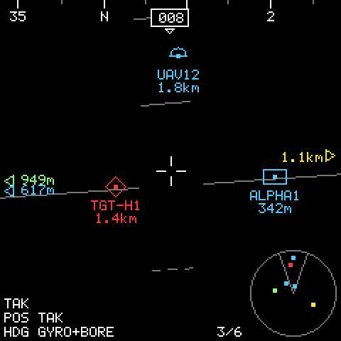
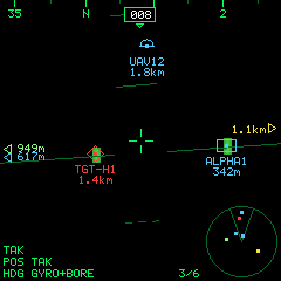

# HUD_Dev: a TAK heads-up display

A prototype heads-up display that joins a TAK network and draws TAK units
where they are in the real world. It uses the **Waveshare
ESP32-S3-LCD-1.3-C** (SKU 30559: ESP32-S3R8, 240×240 ST7789, QMI8658 IMU,
prism cube) and plans for GNSS, a magnetometer, a LiPo, a FLIR Boson thermal
camera, and a rail mount.

 

*Both images are rendered on a PC by the firmware's own drawing code
(`firmware/test_host/render_preview.c`).*

## Open the project page

The page shows every part of the project and how the parts interact: the
data flow, a 3D world with an eye-view HUD simulator, the live HUD over
USB-C/Wi-Fi, 3D hardware, and the thermal and rail concept.

```
python tools/sim_server.py
```
then browse **http://localhost:8000**. This also starts a fake TAK server
for the HUD on TCP 8087.

You can also open `web/index.html` directly in Chrome or Edge. The 3D
views load three.js from cdn.jsdelivr.net, so they need internet. The rest
works offline.

## What's here

| Path | What |
|---|---|
| `firmware/` | ESP-IDF project (v5.3+) for the board: display, IMU/AHRS, Wi-Fi, TAK TCP/TLS client, ATAK mesh (XML + protobuf), USB-phone input, serial console, live-view HTTP API, thermal overlay hooks |
| `firmware/components/hud_core/` | Portable C core: WGS-84/ENU, quaternion + Mahony AHRS, projection, CoT XML + TAK protobuf parsers, target table, NMEA, renderer. No ESP-IDF dependencies |
| `firmware/test_host/` | PC unit tests (339), preview renderer, live CoT end-to-end check |
| `tools/sim_server.py` | Fake TAK server (TCP/TLS/multicast) + scenario + web host |
| `tools/provision.py` | TAK `.p12` client cert + truststore → device settings image (`hudcfg.bin`) |
| `web/` | The project page; `hud_math.js` is a JS port of the firmware renderer (pixel-checked against C) |
| `hardware/` | PCB design study: V2 backpack (GNSS/mag), V2T thermal variant, V3 integrated board, Picatinny/M-LOK mount (OpenSCAD) |
| `docs/` | [HUD math](docs/HUD_MATH.md) · [Calibration](docs/CALIBRATION.md) · [Thermal](docs/THERMAL.md) · [Live view](docs/LIVE_VIEW.md) · [ATAK USB plugin](docs/ATAK_USB_PLUGIN.md) · [Security](docs/SECURITY.md) · [Roadmap](docs/ROADMAP.md) |

## Quick start

Tests (no hardware):
```
firmware/test_host/run_tests.sh            # C core, needs gcc (MSYS2 mingw64 works)
firmware/test_host/run_tests.sh preview    # also render HUD PNG previews
node tests/test_hud_math.js                # JS port vs the same vectors
python tests/gen_vectors.py                # regenerate vectors from tools/hudmath.py
```

Board (needs ESP-IDF v5.3+):
```
cd firmware
idf.py set-target esp32s3
idf.py build
idf.py -p COMx flash monitor               # COMx = the CH343 USB-serial port
```
With no configuration, it boots into **fake targets** at the Kconfig
position. Rotate the board and the units should stay fixed in the world.
Then, on the serial console:
```
wifi <ssid> <password>
tak <your-pc-ip> 8087 tcp
own uid ANDROID-SIM-OWNER      # follow the simulator's "owner phone"
save
reboot
```
For a real TAK Server over TLS 8089, see `tools/provision.py --help` and
[docs/SECURITY.md](docs/SECURITY.md).

## Improvements over the original plan

- **No extra hardware for V1, three ways to get own position:** follow
  your ATAK phone's own SA by UID/callsign (over the TAK Server), use ATAK's
  **multicast mesh** (no server needed), or use a **USB-C cable to the
  phone**, which also powers the HUD and needs a small ATAK plugin.
- **TAK Protocol v1 protobuf** decoding for the mesh. ATAK often multicasts
  protobuf, not XML.
- **Stale handling that doesn't need NTP:** each track expires after its
  own `stale - time` lifetime, measured on the local clock.
- **Heading without a magnetometer:** long-press to align the heading to a
  known unit in the crosshair. Phone compass nudges also work.
- **Two-pose IMU mount calibration:** hold level, then pitch up. That's
  enough to work out how the sensor sits in the prism case.
- **Thermal overlay** with a *hot-only* mode that keeps the beam splitter
  see-through, and a FOV crop so heat and icons share one angular scale.
- **Optics finding:** the prism image isn't collimated. That's fine on a
  desk, but a real HUD or rail build needs a collimating optic or an
  eyepiece (hardware/core_board).

## Status

The C core, the tools, the web page and the design docs are done and
tested on the PC. **The ESP-IDF firmware is written against the v5.3 APIs
but has not been compiled or flashed yet** (ESP-IDF isn't installed on the
dev PC). That's the next step. See [docs/ROADMAP.md](docs/ROADMAP.md).
